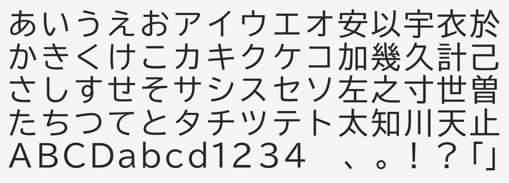

# UDon Nodo Gothic

UDon Nodo Gothic is a universal design typeface designed to be easy to read and ideal for education and business documentation. It is a highly legible and well-balanced design sans serif. In order to make the kanji more clear and identifiable, the letterforms are simplified by omitting hane (hook) and geta (the vertical lines extending beyond horizontal strokes at the bottom of kanji). Counters and other spaces are finely adjusted so that the overall balance of the type is not impaired even with the use in relatively large size. The kana are made slightly smaller than the kanji to give a good rhythm and flow when setting long texts in the lighter weights.

## Building

Fonts are built automatically by GitHub Actions - take a look in the "Actions" tab for the latest build.

If you want to build fonts manually on your own computer:

* `make build` will produce font files.
* `make test` will run [FontBakery](https://github.com/googlefonts/fontbakery)'s quality assurance tests.
* `make proof` will generate HTML proof files.

## Changelog

**11 March 2022**
- Font released with Google Core glyph set

## License

This Font Software is licensed under the SIL Open Font License, Version 1.1.
This license is available with a FAQ at
https://scripts.sil.org/OFL
